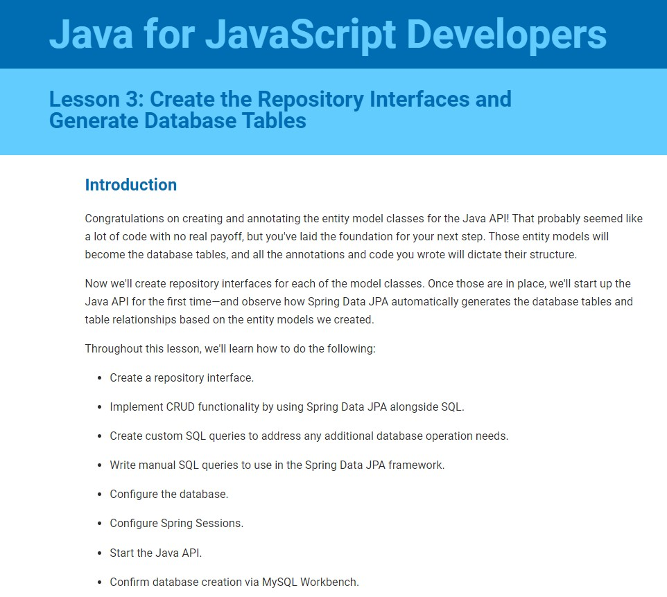

# Tech-news: Java API

  
    
  
   
  
   
  
   
  
   
  
  
  ## Description
  
   Java is the #1 programming language when it comes to job openings, and it’s easy to understand why. It can be used to build a wide array of software, from comprehensive business systems to desktop software to mobile applications. It’s frequently used in financial services, e-commerce, data visualization, and distributed systems. It’s also the language behind many widely used software and development tools such as Eclipse, NetBeans IDE, and IntelliJ Idea.

   While more verbose than JavaScript, its syntax is considered to be straightforward, and it comes with a library of classes that offer commonly used utility functions for most Java programs. Java is backwards-compatible with older versions, which makes it ideal for large codebases, and its standardized naming conventions make it easy to read and pick up by other developers. It also has the benefit of having been around for a relatively long time, meaning that there is an enormous ecosystem of high-quality tools and other Java developers to rely on.

   Just like most other popular programming languages, Java has several frameworks that make it easier to develop applications. The most popular Java framework is Spring, but you might encounter others such as Struts, Grails, Hibernate, Play, and Dropwizard.   
   we'll use the following Java-based technologies in place of MERN:

   * Spring Boot will replace Node.js and Express.js.

   * Spring Data JPA will replace Sequelize.js.

   * Thymeleaf will replace Handlebars.js.

   * Spring Session will replace Express Session.

  ### What we will learn

  * Build a Spring Boot API with the correct project structure and necessary dependencies generated by Spring Initializr

  * Create CRUD operations with Spring Data JPA and MySQL

  * Set up and configure the local environment and back-end server for Java

  * Use Thymeleaf to add templating to the application to allow for user interactions

  * Create front-end and back-end Controllers to maintain and process the application flow

  * Highlight similarities between JavaScript and Java

  * Deploy a Java application to Heroku

  * FUN FACT: Java is considered a "high-ceremony language". Whereas in JavaScript we can simply input console.log("Hello, World!") and run the code as is, Java requires a bit more work to get to that point.
    Before we can run it, we need to go through a step called compilation. This process involves converting the Java code into bytecode, which is readable by the Java virtual machine (JVM). Compilation allows the code we write to be run and understood by any computer with the JVM installed.
    In IntelliJ IDEA, right-click HelloWorld.java, then select "Run HelloWorld.main()."
    Your code will be compiled and then run. This should open a window in the bottom of your editor that shows the path to the java.exe file, the file you're running, and the line you printed: "Hello, World!".
    The screenshot below shows the compilation process that prints out the message "Hello, World!".
     
     
    

 
  ## Table of Contents
  - [Description](#description)
  - [Documentation](#documentation)
  - [Usage](#usage)
  - [Screenshot](#screenshot)
  - [Features](#features)
  - [Acknowledgements](#acknowledgements)
  - [License](#license)
  - [Testing](#testing)
  - [Contact](#contact)

  ## Documentation
  * The Java Development Kit (JDK) is a development environment for building applications using Java. It also includes useful tools for developing and testing programs and allows you to install Java on your computer. 
  <https://www.oracle.com/technetwork/java/javase/downloads/jdk8-downloads-2133151.html/>

  * IntelliJ IDEA is an integrated development environment (IDE) written in Java. You’ll use the IntelliJ IDEA to write the code for your Java application. 
  <https://www.jetbrains.com/idea/>

  * Spring is an open-source application framework for the Java platform. Spring Boot is Spring's solution for creating standalone, production-grade Spring-based applications that require minimal configuration to get up and running. You’ll use Spring Initializr to create a Spring Boot Java microservice project. Its user interface allows you to select the project configuration variables and dependencies necessary for the project. 
  Spring
  <https://spring.io/> 
  Spring Boot
  <https://spring.io/projects/spring-boot> 
  Spring Initializr
  <https://start.spring.io/>

  * The Spring Web dependency allows developers to build RESTful web applications using Spring MVC. 
  <https://mvnrepository.com/artifact/org.springframework/spring-web>

  * Spring Data JPA is an implementation of the Jakarta Persistence API, which is the Object Relational Mapper standard for storing, accessing, and managing Java objects in a relational database. For this project we will use the Spring Data JPA dependency. 
  Spring Data JPA
  <https://spring.io/projects/spring-data-jpa> 
  Spring Data JPA dependency
  <https://mvnrepository.com/artifact/org.springframework.data/spring-data-jpa>

  * MySQL Driver is the dependency that will connect your Java application to a MySQL database. 
  MySQL Driver
  <https://mvnrepository.com/artifact/net.sourceforge.javydreamercsw/MySQL-Driver>

  * Spring Session provides an API and implementations for managing a user’s session information. For this course, you’ll use the Spring Session dependency 
  Spring Session
  <https://spring.io/projects/spring-session> 
  Spring Session dependency
  <https://mvnrepository.com/artifact/org.springframework.session/spring-session>

  * Thymeleaf is a Java template engine used to serve HTML at the View layer of MVC-based web applications. For this course, you’ll use the Thymeleaf dependency to integrate it as part of your Spring application. <https://www.thymeleaf.org/>

 * MVN (Maven) Repository <https://mvnrepository.com/> is a dependency repository that you’ll use to find additional dependencies for your project, including the following: 

 * Spring Security is a framework that focuses on providing both authentication and authorization to Java applications. For this project, we’ll use the Spring Security Core dependency 
 Spring Security <https://spring.io/projects/spring-security> 
 Spring Security Core dependency <https://mvnrepository.com/artifact/org.springframework.security/spring-security-core>

 * Thymeleaf Layout Dialect <https://ultraq.github.io/thymeleaf-layout-dialect/> is a dialect for Thymeleaf that lets you build layouts and reusable templates in order to improve code reuse. For this project, we’ll use the Thymeleaf Layout Dialect dependency <https://mvnrepository.com/artifact/nz.net.ultraq.thymeleaf/thymeleaf-layout-dialect>

 * Spring Session JDBC <https://spring.io/projects/spring-session-jdbc> provides SessionRepository implementation backed by a relational database and configuration support. For this project, we’ll use the Spring Session JDBC dependency <https://mvnrepository.com/artifact/org.springframework.session/spring-session-jdbc>

 * MySQL Workbench is a unified visual tool that provides a user interface so that developers can visually design, model, generate, and manage MySQL databases. <https://www.mysql.com/products/workbench/>

 * Insomnia Core is a powerful REST API client that allows us to test APIs and make client-side server requests without having to use a browser. <https://insomnia.rest/>

 ### Where I left off
 <https://coding-boot-camp.github.io/continuation-courses/java/up-and-running> 

 
 
  ## Usage
  TBD

  ## Screenshot
  

  ## Features
  TBD
  
  # Acknowledgements
  TBD
    
  ## License
  
   
  Permission to use this application is granted under the MIT license. <https://opensource.org/licenses/MIT>

  ## Testing
  Insomnia Core

  ## Contact:
  Holler at me! <a href="mailto:rob.atalla@robatalla816.com">rob.atalla@robatalla816.com</a>